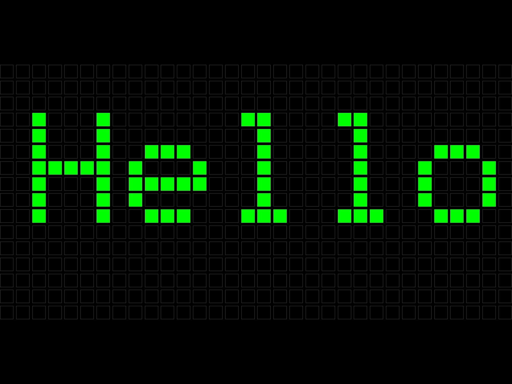

# swift-gfx-wrapper

This is currently a WIP.

## What is this?

This is a Swift -> Objective C -> C / C++ wrapper around the [Adafruit GFX library](https://github.com/adafruit/Adafruit-GFX-Library) meant to be ran in an iOS / macOS / watchOS environment.

## Why would you use it?

- Prototyping for a device that runs the Adafruit GFX library (e.g. a NeoMatrix)
- Generating the pixel buffer for a device that you want to push to
- Playing with pixel graphics in an iOS / macOS / watchOS environment

## Getting started

An example project is included in this library to get started. SwiftUI is optional. Anything that can observe changes to pixels will work. `GFXMatrix` can be subclassed to fit your needs.

## Supported platforms

- iOS 14.1+
- macOS 11+
- watchOS 7.2+

### Initialize Git submodules
`git submodule update --init`

### Carthage installation

Add this to your Cartfile: `github "twstokes/swift-gfx-wrapper"`
